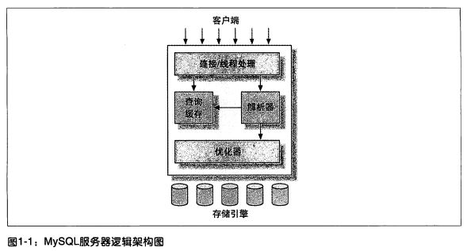

# 第1章 MySQL架构与历史

标签：MySQL

---

## 译者序

- MySQL早期历史
	- MySQL曾未很多中小网站建站的首选技术架构(LAMP Linux+Apahce+MySQL+PHP)
	- 基于高并发的压力,逐渐被商业的Oracel数据库代替
	- 由于Oracel受到硬件方面的局限性,MySQL新版本提高高可用性(InnoDB事务)等逐渐赢回团队生产

---

## 本书结构目录

- 第1章 简述MySQL概念和历史
- 第2章-第7章 基础知识部分,从实际测试、故障应对,到设计原则(包括对不同数据类型、索引的物理设计、查询优化、更高级的特性)介绍
- 第8章-第9章 如何实际配置应用程序,包括配置MySQL硬件软件和解释原理
- 第10章-第15章 应用于整个应用架构的设计,包括一到多复制、可扩展性、稳定性、云应用、前后端全方位优化、备份与恢复处理
- 第16章 MySQL相关的监控和管理工具

---

## MySQL架构

- 特点
	- 数据处理和存储/提取分离,较灵活

- 客户端与服务端连接过程与安全性
	- 先认证用户名、主机信息和密码
	- 再认真执行特定查询权限
- 优化与执行
	- MySQL解析查询后会对该查询优化
	- 用户可修改优化器
	- 用户可查询优化过程

---

## 并发控制

- MySQL可在两个层面进行并发控制
	- 服务器层与存储引擎层(未详细介绍)
- 如何控制并发读写
	- 读写锁.读为共享锁,写为排他锁.
	- 锁粒度.
		- 优点: 让锁定对象更有选择,提高系统的并发程度
		- 附加: 加锁占用系统开销,锁策略即实现锁的开销与安全性寻求平衡和性能
		- 表级锁.最高效的锁.写锁比读锁有更高的优先性
		- 行级锁.最小的锁.只在存储引擎层实现非MySQL服务层
	- MySQL支持多个存储引擎,可结合多种解决方案.大多数商业数据库系统在表上施加行级锁,追求更好的性能.
	- 锁粒度增加对计算机性能要求高、对资源等如磁盘空间要求更多.需要根据实际业务由用户自主决定

---

## 事务

### 基本概念

- ACID原则(以银行取存钱为例)
	- Atomicity 原子性 整个事务为一个不可分的整体
	- Consistency 一致性 前后数据状态一致性,未COMMIT不保存修改
	- Isolation 隔离性 事务COMMIT前对其他事务不可见
	- Durability 持久性 模糊概念.事务提交后修改永久保留到数据库
- 四种隔离级别
	- READ UNCOMMITTED 未提交读 事务A执行中可见事务B未COMMIT的事务,出现"脏读",性能普通实际应用少用
	- READ COMMITTED 提交读 事务A执行中只可见事务B已COMMIT的事务,避免"脏读",但同一事务重复查询可能得到不一致数据.称"不可重复读"
	- REPEATABLE READ 可重复度 事务A执行中无视事务B的任何操作,同一事务中多次读取同一数据.但却会出现"幻读",即事务A执行中事务B已在该范围中插入新的纪录.(InnoDB可用MVCC解决该问题)
	- SERIALIZABLE 可串行化 最高的隔离级别,通过强制事务串行执行,对读取的每一行都加锁,但引发大量的超时和锁争用问题,非必需情况需要保证数据一致性和接受无并发条件,很少使用.
- 涉及专业名词:
	- 脏读 事务可以读取未提交的数据
	- 不可重复读 一个事务从开始指导提交之前,两次执行同样的查询,可能会得到不一样的结果
	- 幻读 指的某个事务在读取某个范围内的记录时,另一个事务又在该范围内插入了新记的记录,当之前的事务再次读取该范围的记录时,会产生换行.
- 选用:
	- 一般数据库选择READ COMMITTED级别,MySQL选择REPEATABLE READ级别

### 死锁

- 解决方式: 死锁检测和死锁超时.
- InnoDB目前处理的方式时将持有最少行级排他锁的事务进行回滚
- 产生的两重原因:
	- 真正的数据冲突,难以避免
	- 存储引擎的实现方式.锁的行为和顺序与存储引擎相关

### 事务日志

- 执行过程
	- 存储引擎只需修改其内存拷贝,再等待事务日志持久以后被刷回磁盘
- 优势
	- 事务日志可以帮助提高事务的效率.
	- 并且如果数据的修改已经记录到事务日志并持久化，但数据本身还未写回磁盘,系统崩溃,存储引擎重启时也能自动恢复这部分修改的数据.视存储引擎而定

### MySQL中的事务

- 自动提交
	- 默认对每句为自动提交 AUTOCOMMIT ,可修改配置`SHOW VARIABLES LIKE 'AUTOCOMMIT'` 1或者ON为启用,0或OFF为禁用
- 显式提交
	- 关闭后,所有查询均在一个事物中,在事务与非事务中均应显式使用COMMIT提交或者ROLLBACK回滚.然而还有一些DDL数据定义语言，比如ALTER TABLE等在执行之前会强制执行COMMIT提交当前的活动事务，需要查阅官方文档来确认避免出错
- 隔离级别可自定义修改
	-  `SET SESSION TRANSACTION ISOLATION LEVEL READ COMMITED`
- 混合存储引擎实际缺陷
	- 不建议在事务中使用混合存储引擎,一表可回滚一表不可,将导致各表处于不一致状态
- 实际项目应用
	- 从版本与事务的差异上,联系应用到实际项目中数据库脚本的编写应考虑版本说明和语句等差异,注意指定存储引擎、字符集、原数据库数据是否影响等因素
- 注意
	- AUTOCOMMIT操作只针对事务型表,MyISAM不指出事务,修改无效
- 建议
	- 存储引擎有自身的锁策略会根据隔离级别在需要的时候自动加锁,虽支持通过指定语句进行显式锁定,但不属于SQL规范.容易与现有锁策略发生冲突.`SELECT ... LOCK IN SHARE MODE / SELECT ... FOR UPDATE ` 除了事务中禁用了AUTOCOMMIT可以使用LOCK TABLES之外,任何时候都不要显式地执行LOCK TABLES不管是什么存储引擎

---

## 多版本并发控制

- 原理简述
	- MVCC允许数据具有多个版本，这个版本可以是时间戳或者是全局递增的事务ID，在同一个时间点，不同的事务看到的数据是不同的
- InnoDB检查每行记录的原则 
	- SELECT 符合该原则的才会被返回
		- 行的创建时间(即该系统版本号)早于当前事务的系统版本号，则保证事务读取的行已存在
		- 行的删除版本要么未定义，要么大于当前事务版本号，确保事务读取到的行在事务之前未被删除
	- INSERT
		- 将当前事务版本号作为新行的系统版本号
	- DELETE
		- 将该行的删除标识赋于当前事务版本号
	- UPDATE
		- UPDATE = insert+delete ，分别对新行INSERT 操作，和旧行DELETE 操作

---

## MySQL存储引擎特点

- 命令：查看当前表的状态，包括存储引擎等信息
	-  `SHOW TABLE STATUS LIKE 'user '\G ` 
- MyISAM特点简记2018/7/22 9:27:01 ：
	- 不支持事务和行级锁
	- 支持全文本搜索
	- 一个大缺陷是崩溃后无法安全恢复
- Memory特点简记：
	- 查询速度快，因为所有数据保存在内存，不需要进行磁盘I/O
	- 且Memory表的结构在重启以后还会保留，但数据会丢失
- 还有一些第三方存储引擎可供用户选择
- 选择引擎需考虑的方面
	- 是否需要事务
	- 对备份的要求. InnoDB支持在线热备份
	- 崩溃恢复. MyISAM崩溃后数据发生损坏的概率比InnoDB高的多，所以即使不需要事务支持，很多人也选择InnoDB引擎，这是一个非常重要的因素
	- 其他特性
- 日志型应用
	- 场景:如某些需要快速插入&大量的日志到Mysql中，选用MyISAM或Archive存储引擎较合适，因为它们开销低，且插入速度非常快
	- 特殊情况：除了插入数据还要对记录的日志做分析报表，需要分离插入和查询，避免性能过低
		- 解决方案一：复制一份到备库，备库耗时的查询与主库高效插入分离，并在系统负载较低的时候执行报表查询。然而这个策略日后可能会导致问题。
		- 解决方案二：在日志记录表的名字包含年和月的信息，只在没有插入操作的历史表上做查询，不影响新插入操作。
- 只读或者大部分情况下只读的表
	- 选择：若不考虑崩溃恢复问题，建议使用MyISAM.读多写少的业务.
	- 注意：崩溃恢复当出现在数据量几T后，风险非常大。MyISAM只将数据写到内存中，然后等待操作系统定期将数据刷到磁盘上。此处可对比上面事务日志和Memory的特点进行对比。
	- 推荐: 前期在性能测试环境模拟真实的环境，运行应用，然后拔下电源模拟崩溃测试。实际测试经验是非常重要和可靠的参考依据。
	- 质疑：对于某些'MyISAM比InnoDB快'的经验之谈，InnoDB实际在很多已经场景均比MyISAM优，MyISAM引擎虽快，但随着应用压力的上升，可能迅速恶化，初夏内阁中锁争用，崩溃后数据丢失等问题。
- 类似订单处理
	- 需使用事务处理，则事务处理为必要选项
- 大数据量
	- 对大数据量的加深理解，原文所提我们创建或者管理的很多InnoDB数据库的数据量在3~5TB之间，甚至更大，这是单台机器上的量。所以若采用MyISAM崩溃恢复就是一个噩梦。

---

## 转换表引擎的几种方式

- 直接修改表引擎
	- 命令：`ALTER TABLE t_A ENGINE=InnoDB`
	- 注意：慢，且将丢失原引擎所有特性，如之前设置的外键
- 导出和导入
	- 方法：使用mysqldump工具将数据导出到文件，再修改存储引擎选项和表名后进行重新导入
	- 注意：mysqldump默认在CREATE TABLE 语句前加上DROP TABLE，不过这点可能导致数据丢失
- 创建与查询
	- 创建新表 `INSERT INTO t_b SELECT * FROM t_a`
	- 注意: 数据量过大可使用分批处理，且该方法仍丢失了原表的主键，外键等属性，需要自己添加且容易出错
	- 推荐: pt-online-schema-change工具（基于Facebook的在线schema变更技术）
	- 思考：这里能否自己写一个工具解决同步拷贝表保留主键、外键?

